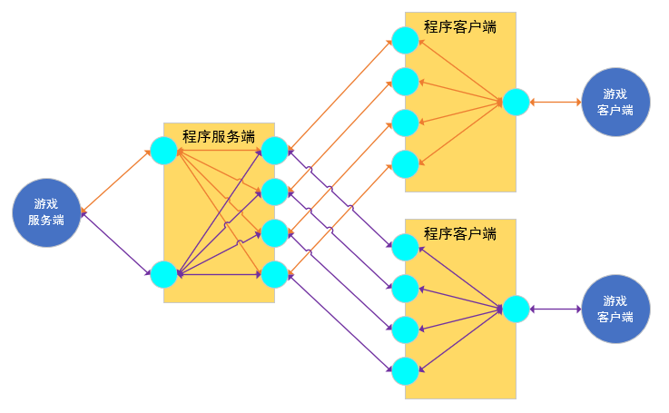

# 功能介绍
## 开发背景
现在IPV6普及了，一些游戏服务还是仅支持IPV4连接。因此开发一个软件，让仅支持IPV4的游戏服务，也能通过IPV6访问。
## 逻辑功能
整体流程，游戏服务端<-->软件服务端端<-->软件客户端<-->用户客户端。软件客户端和服务端的作用就是将IPV4转为IPV6，它们之间使用IPV6通信，并且会循环切换使用的端口号，目的是防止运营商使用五元组QOS导致udp丢包，目前软件仅支持udp协议的转发。
# 如何使用

## 服务端配置
    1. 假设你要让客户端能访问你本地主机的27015端口上的服务。
    2. 那么[服务器监听端口]就设置为27015。
    3. [远程连接端口]要与客户端配置的[服务端监听端口]一致。
    4. 配置完成后点击运行服务端，运行日志没有报错就成功启动了，有报错一般是配置有问题，重新配置解决。
## 客户端配置
    1. [服务端IPV6地址]就填写对方主机的公网IPV6地址。
    2. [服务端监听端口]与服务端配置的[远程连接端口一致]。
    3. [远程连接端口]理论上可以随便配置，建议直接默认使用。
    4. [本地监听端口]理论上可以随便配置，这里值为3460。
    5. 配置完成后点击运行客户端，运行日志没有报错就成功启动了，有报错一般是配置有问题，重新配置解决。